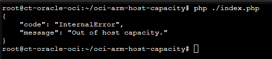

# Evitar los fallos de "Out of Capacity" de la nube de Oracle para tener una instancia/ VPS con 4vCPU y 24GB de RAM


**Nota importante:** Probablemente **no será necesario complicarse tanto para la instancia gratuita** si la cuenta de Oracle que tienes la has actualizado a "Pay As You Go", pero en caso de que aún así te dé fallo (o no tienes manera de insertar un método de pago válido), esta solución es ideal.

Para poder ejecutar esto es necesario tener **PHP 7.x or 8.x** y **composer** instalado en tu máquina para llamar a la API de Oracle "LaunchInstance" [endpoint](https://docs.oracle.com/en-us/iaas/api/#/en/iaas/20160918/Instance/LaunchInstance).

Usaremos el paquete desarrollado por [@hitrov](https://github.com/hitrov) - [oci-api-php-request-sign](https://packagist.org/packages/hitrov/oci-api-php-request-sign).

## Generar API Key

Iniciaremos sesión en nuestra cuenta de [Oracle](http://cloud.oracle.com/) e iremos a la imagen de nuestro **perfil --> "User settings"**.


Iremos a **Recursos --> API Keys**, y agregaremos una nueva API Key.


Nos **descargamos la API Key privada y le damos a "agregar"** para que se mantenga en nuestra cuenta.


Nos aparecerá la información para poder validar la API Key (fingerprint), donde **guardaremos esta información** para utilizarla a la hora de atacar al servicio de Oracle.


## Requisisitos

Lo ideal es que la instalación la realicemos en algúna máquina virtual para simplificar el proceso y evitar posibles fallos con dependencias.

En mi ejemplo lo voy a dejar **en una máquina de Debian 12 montada en un contenedor LXC en proxmox sin nada instalado**, pero se puede dejar instalado:

- En tu propio ordenador.

- En un entorno de Docker.

- En una máquina virtualizada (Hyper-V, Virtualbox, VMWare, Parallels).


## Instalación

Nos instalaremos **composer** y **git**.

`apt-get install composer -y`


`apt-get install git -y`


Y las **dependencias de PHP** que requerirá el repositorio.

`apt update && apt install php8.2-curl php8.2-xml php8.2-dom php8.2-simplexml -y`


**Clonaremos** este repositorio.
```bash
git clone https://github.com/hitrov/oci-arm-host-capacity.git
```

Y después **nos iremos a la carpeta** recién clonada.

```bash
cd oci-arm-host-capacity/
```


**Instalaremos** las siguientes dependencias de composer:

- `composer require aws/aws-sdk-php`


- `composer require hitrov/oci-api-php-request-sign`


Y finalmente **actualizaremos el composer**.

`composer update`


### Tener la private key en el servidor

Será necesario que la "private key" que hemos generado antes **esté accesible por el servidor**, ya que con ella es con quién podremos realizar la petición por API.

En mi caso antes, **este fichero** era el que me descargué con el siguiente nombre.

`oracle@enrico.es_2025-05-17T16_17_41.921Z.pem`

Lo que haré **será dejarlo en el servidor de Debian**, en la misma carpeta donde estamos trabajando, **cambiándole el nombre** a algo más sencillo.

`mv oracle@enrico.es_2025-05-17T16_17_41.921Z.pem enrico.es_private.pem`


### Copiar fichero de configuración

**Haremos una copia del fichero de configuración de ejemplo** (`.env.example`) para poder generar nuestro propio fichero de configuración.

```bash
cp .env.example .env
```


#### Obtener OCI_SUBNET_ID, OCI_IMAGE_ID, 

Estos dos valores ahora mismo **no los tendríamos localizados**, y eso es algo que se ha de conseguir de la siguiene manera:

1. Tendremos que crear nuestra instancia desde la web de [Oracle](https://cloud.oracle.com/compute/instances/create) y seleccionar el tipo de instancia que queremos. Idealmente lo que queremos será:

    -   **Capacidad**: VM.Standard.A1.Flex con 4 OCPU y 24GB de RAM
    -   **Disco duro**: 200GB

    Digo idealmente, ya que **la capacidad máxima que entraría en una cuenta gratuita de Oracle** sería lo antes indicado:


2. Lo único importante será que tendremos que indicar **que no querremos claves SSH**, las generaremos después para poder acceder a la instancia.


3. Antes de darle al botón de crear, **abriremos la consola de desarrollador del navegador (F12)**, para poder obtener estos valores.


4. Le daremos al **botón de "Create"**, donde probablemente nos falle.

5. Iremos en la **consola** --> **"Network"** y:

    -   Filtraremos por **"instances"**.
    -   **Seleccionaremos** la opción que aparezca --> Click derecho.
    -   Iríamos a **"Copy Value"** --> **"Copy as cURL"**.


6. Esto **nos guardará en el portapapeles un texto muy largo**, de este estilo.


7. En este texto, **buscaremos y anotaremos** los valores siguientes:

    -   **subnetId** (OCI_SUBNET_ID en nuestro script)

    -   **imageId** (OCI_IMAGE_ID en nuestro script)

    -   **availibityDomain** (OCI_AVAILIBITY_DOMAIN en nuestro script)


#### Generar claves SSH pública y privada (para obtener valor OCI_SSH_PUBLIC_KEYS)

Para poder acceder a la instancia una vez creada, será necesario que tengamos unas claves SSH pública y privada para poder acceder a él por SSH.

Por ello, generaremos estos ficheros con el siguiente comando.

`ssh-keygen -t rsa -b 4096 -C "oracle@enrico.es"`


Y guardaremos el valor de la clave pública para usarla en la variable OCI_SSH_PUBLIC_KEYS.

`cat ~/.ssh/id_rsa.pub`


#### Editar fichero .env

Ya con todas las variables obtenidas, simplemente editaremos el fichero .env rellenándo las siguienes variables:

- **OCI_REGION** --> Obtenido al generar una API Key.
- **OCI_USER_ID** --> Obtenido al generar una API Key.
- **OCI_TENANCY_ID** --> Obtenido al generar una API Key.
- **OCI_KEY_FINGERPRINT** --> Obtenido al generar una API Key.
- **OCI_PRIVATE_KEY_FILENAME** --> Obtenido al generar una API Key.
- **OCI_SUBNET_ID** --> Obtenido de la petición por web con cURL.
- **OCI_IMAGE_ID** --> Obtenido de la petición por web con cURL.
- **OCI_AVAILABILITY_DOMAIN** --> Obtenido de la petición por web con cURL.


### Lanzar el script de PHP

Ya con todo generado, simplemente lanzaremos el script de php con la siguiente línea; el cuál probablemente nos dará un error de "Out of host capacity", indicándo que la petición API es correcta.

`php ./index.php`




Assigning public IP address

We are not doing this during the command run due to the default limitation (2 ephemeral addresses per compartment). That's how you can achieve this. When you'll succeed with creating an instance, open OCI Console, go to Instance Details -> Resources -> Attached VNICs by selecting it's name

Attached VNICs

Then Resources -> IPv4 Addresses -> Edit

IPv4 Addresses

Choose ephemeral and click "Update"

Edit IP Address