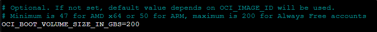

# Evitar los fallos de "Out of Capacity" de la nube de Oracle para tener una instancia / VPS con 4vCPU, 24GB de RAM y 200GB de almacenamiento

**Nota:** Probablemente no será necesario complicarse tanto para la instancia gratuita **si la cuenta de Oracle que tienes la has actualizado a "Pay As You Go"**.

En caso de que aún así te dé fallo (o no tienes manera de insertar un método de pago válido), esta solución es ideal.

- [Requisitos](#requisitos)
- [Instalación](#instalación)
  - [Generar API Key](#generar-api-key)
  - [Tener acceso a la private key en el servidor](#tener-acceso-a-la-private-key-en-el-servidor)
  - [Copiar fichero de configuración](#copiar-fichero-de-configuración)
  - [Obtener OCI_SUBNET_ID, OCI_IMAGE_ID](#obtener-oci_subnet_id-oci_image_id)
  - [Generar claves SSH pública y privada (OCI_SSH_PUBLIC_KEYS)](#generar-claves-ssh-pública-y-privada-para-obtener-valor-oci_ssh_public_keys)
  - [Editar fichero .env](#editar-fichero-env)
- [Lanzar script de PHP](#lanzar-script-de-php)
- [Programar ejecución (crontab)](#programar-ejecución-crontab)
- [Asignar IP Pública](#asignar-ip-pública)
  - [Acceder por SSH (Linux)](#acceder-por-ssh-linux)
  - [Acceder por SSH (Windows)](#acceder-por-ssh-windows)
- [Opcional - Agregar notificaciones Telegram](#opcional---agregar-notificaciones-telegram)

## Requisisitos

Para poder ejecutar esto es necesario tener **PHP 8.x y composer** instalado en tu máquina para llamar a la API de Oracle "LaunchInstance" [endpoint](https://docs.oracle.com/en-us/iaas/api/#/en/iaas/20160918/Instance/LaunchInstance).

Usaremos el paquete desarrollado por [@hitrov](https://github.com/hitrov) - [oci-api-php-request-sign](https://packagist.org/packages/hitrov/oci-api-php-request-sign).

Lo **ideal es que la instalación la realicemos en algún entorno virtual** para simplificar el proceso y evitar posibles fallos con dependencias.

En mi ejemplo lo voy a dejar **en una máquina de Debian 12 montada en un contenedor LXC en proxmox sin nada instalado**, pero se puede dejar instalado:

- En tu propio ordenador.

- En un entorno de Docker.

- En una máquina virtualizada (Hyper-V, Virtualbox, VMWare, Parallels).


## Instalación

Nos instalaremos **composer** y **git**.

`apt-get install composer -y`


`apt-get install git -y`


Y las **dependencias de PHP** que requerirá el repositorio, en este caso ya usando PHP 8.

`apt update && apt install php8.2-curl php8.2-xml php8.2-dom php8.2-simplexml -y`


**Clonaremos** este repositorio.
```bash
git clone https://github.com/hitrov/oci-arm-host-capacity.git
```

Y después **nos iremos a la carpeta** recién clonada.

```bash
cd oci-arm-host-capacity/
```


**Instalaremos** las siguientes dependencias de composer:

- `composer require aws/aws-sdk-php`


- `composer require hitrov/oci-api-php-request-sign`


Y finalmente **actualizaremos el composer**.

`composer update`


### Generar API Key

Iniciaremos sesión en nuestra cuenta de [Oracle](http://cloud.oracle.com/) e iremos a la imagen de nuestro **perfil --> "User settings"**.


Iremos a **Recursos --> API Keys**, y agregaremos una nueva API Key.


Nos **descargamos la API Key privada y le damos a "agregar"** para que se mantenga en nuestra cuenta.


Nos aparecerá la información para poder validar la API Key (fingerprint), donde **guardaremos esta información** para utilizarla a la hora de atacar al servicio de Oracle.


### Tener acceso a la private key en el servidor

Será necesario que la "private key" que hemos generado antes **esté accesible por el servidor**, ya que con ella es con quién podremos realizar la petición por API.

En mi caso antes, **este fichero** era el que me descargué con el siguiente nombre.

`oracle@enrico.es_2025-05-17T16_17_41.921Z.pem`

Lo que haré **será dejarlo en el servidor de Debian usando [WinSCP](https://winscp.net/eng/docs/lang:es)**.

Lo dejaremos en la misma carpeta donde estamos trabajando, **cambiándole el nombre** a algo más sencillo.

`mv oracle@enrico.es_2025-05-17T16_17_41.921Z.pem enrico.es_private.pem`


### Copiar fichero de configuración

**Haremos una copia del fichero de configuración de ejemplo** (`.env.example`) para poder generar nuestro propio fichero de configuración.

```bash
cp .env.example .env
```


### Obtener OCI_SUBNET_ID, OCI_IMAGE_ID

Estos dos valores ahora mismo **no los tendríamos localizados**, y eso es algo que se ha de conseguir de la siguiene manera:

1. Tendremos que crear nuestra instancia desde la web de [Oracle](https://cloud.oracle.com/compute/instances/create) y seleccionar el tipo de instancia que queremos. Idealmente lo que queremos será:

    -   **Capacidad**: VM.Standard.A1.Flex con 4 OCPU y 24GB de RAM
    -   **Disco duro**: 200GB

    Digo idealmente, ya que **la capacidad máxima que entraría en una cuenta gratuita de Oracle** sería lo antes indicado:


2. Lo único importante será que tendremos que indicar **que no querremos claves SSH**, las generaremos después para poder acceder a la instancia.


3. Antes de darle al botón de crear, **abriremos la consola de desarrollador del navegador (F12)**, para poder obtener estos valores.


4. Le daremos al **botón de "Create"**, donde probablemente nos falle.

5. Iremos en la **consola** --> **"Network"** y:

    -   Filtraremos por **"instances"**.
    -   **Seleccionaremos** la opción que aparezca --> Click derecho.
    -   Iríamos a **"Copy Value"** --> **"Copy as cURL"**.


6. Esto **nos guardará en el portapapeles un texto muy largo**, de este estilo.


7. En este texto, **buscaremos y anotaremos** los valores siguientes:

    -   **subnetId** (OCI_SUBNET_ID en nuestro script)

    -   **imageId** (OCI_IMAGE_ID en nuestro script)

    -   **availabilityDomain** (OCI_AVAILIBITY_DOMAIN en nuestro script)


### Generar claves SSH pública y privada (para obtener valor OCI_SSH_PUBLIC_KEYS)

Para poder acceder a la instancia una vez creada, **será necesario que tengamos unas claves SSH pública y privada para poder acceder a él por SSH.**

Por ello, **generaremos estos ficheros** con el siguiente comando.

`ssh-keygen -t rsa -b 4096 -C "oracle@enrico.es"`


Y **guardaremos el valor de la clave pública** para usarla en la variable **OCI_SSH_PUBLIC_KEYS.**

`cat ~/.ssh/id_rsa.pub`


### Editar fichero .env

Ya con todas las variables obtenidas, **simplemente editaremos el fichero .env** rellenándo las siguienes variables:

- **OCI_REGION** --> Obtenido al generar una API Key.
- **OCI_USER_ID** --> Obtenido al generar una API Key.
- **OCI_TENANCY_ID** --> Obtenido al generar una API Key.
- **OCI_KEY_FINGERPRINT** --> Obtenido al generar una API Key.
- **OCI_PRIVATE_KEY_FILENAME** --> Obtenido al generar una API Key.
- **OCI_SUBNET_ID** --> Obtenido de la petición por web con cURL.
- **OCI_IMAGE_ID** --> Obtenido de la petición por web con cURL.
- **OCI_AVAILABILITY_DOMAIN** --> Obtenido de la petición por web con cURL.
- **OCI_SSH_PUBLIC_KEY** --> Obtenido al generar nuestros certificados SSH.
- **OCI_BOOT_VOLUME_SIZE_IN_GBS** --> Indicaremos el tamaño máximo del disco que entra en always free (**200GB**).-




## Lanzar script de PHP

Ya con todo generado, simplemente **lanzaremos el script de php con la siguiente línea**, el cuál probablemente nos dará un error de "Out of host capacity". Eso significará que la petición API es correcta.

`php ./index.php`


## Programar ejecución (crontab)

Ya teniendo este script configurado y validado que funcionaría, **solo quedaría dejar programado la ejecución de este script** para que lo reintente cada x minutos.

Para ello, haremos lo siguiente:

1. **Crearemos un fichero de log** para almacenar los intentos.

`touch oci.log`

2. **Encontraremos la ruta absoluta de nuestro repositorio** donde estaría el script con el siguiente comando.

`readlink -f oci.log`

En nuestro ejemplo, **nuestra ruta absoluta será** `/root/oci-arm-host-capacity/`.


3. **Editaremos crontab para que cada 5 minutos se lance este script** y se guarde el resultado en el fichero de log.

`crontab -e`

4. **Agregaremos la siguiente línea**, utilizando las rutas absolutas para evitar problemas.

`*/5 * * * * /usr/bin/php /root/oci-arm-host-capacity/index.php >> /root/oci-arm-host-capacity/oci.log`


5. Estaría todo listo, **simplemente a esperar** hasta que nos diesen la instancia.

6. Sabremos que nos han dado la instancia cuando en el log aparezca un mensaje que empiece por **"Already have an instance(s) [instance-YYYYMMDD-hhmm] in state(s) (respectively) [RUNNING]"**


6. La instancia **nos la darán con un nombre generado con la fecha de creación** (instance-20250601-1735) en mi caso.


## Asignar IP Pública

Este apartado **no se puede hacer mediante API por los límites que tiene.**

Simplemente, teniendo ya la instancia creada en Oracle, nos iremos a **Details** -> **Resources** -> **Attached VNICs**.


Después iremos a **Resources** -> **IPv4 Addresses** -> **Edit**.


Elegiremos una **EPHEMERAL PUBLIC IP** y actualizaremos.


Y se **nos quedará la IP Pública ya visible** y asignada.


### Acceder por SSH (Linux)

De esta manera **podremos acceder a la instancia por IP Pública.**

Haremos la prueba desde el propio equipo donde generamos las claves SSH, por simplicidad.

`ssh -i ~/.ssh/id_rsa ubuntu@143.47.57.156`


### Acceder por SSH (Windows)

Para poder accede por Windows haremos uso de [PuTTY](https://www.putty.org/), pero para ello tendremos que hacer varios pasos:

1. Tendremos que **copiar la clave privada (y pública) para descargarlas en nuestro equipo Windows**, la exportaremos en dos ficheros.

`cp ~/.ssh/id_rsa ./ssh_vps` --> Clave privada

`cp ~/.ssh/id_rsa.pub ./ssh_vps.pub` --> Clave pública


2. **Entraremos por WinSCP para descargarnos estos ficheros** a nuestra máquina Windows.


3. Con PuTTY ya instalado, **abriremos PuTTYgen** e iremos a "Load existing key file". Seleccionaremos nuestro fichero con la clave privada.


4. Tras esto, ya **podremos guardar la clave privada** en el formato de PuTTY.


5. Abriremos PuTTY e iremos a **Connection --> SSH --> Auth --> Credentials** donde indicaremos el fichero que acabamos de generar.


6. Ya con esto, en **Sessions** indicaremos la IP Pública de la instancia y **nos conectaremos**.


7. Iniciaremos con el **usuario "ubuntu"** y ya estaríamos dentro de la instancia de Oracle


Aquí podemos comprobar que el equipo **tiene 4 vCPU, 24GB de RAM y 50GB de disco duro** (ya que no guardé bien la variable que la aumenta a 200GB cuando la creé...)

## Opcional - Agregar notificaciones Telegram

Si queremos tener una manera de que el propio servicio nos notifique cuando tengamos la instancia creada **podremos realizarlo** si tenemos un bot de Telegram (es muy sencillo crear uno, no es necesario explicarlo)

1. Crear un **fichero telegram.env** donde indicaremos el token de nuestro bot y el chatid donde queremos que el bot escriba.


2. **Copiaremos el contenido** del fichero `check_oci_log.sh` de este repositorio para tener el script listo.

`curl -O https://raw.githubusercontent.com/enkirro/oracle-creacion-instancias-api/refs/heads/main/check_oci_log.sh`

Este script **comprobará en el fichero oci.log** si hay una línea con el contenido `Already have an instance(s)` que indicaría que nuestra instancia estaría creada.

3. Le **daremos permisos de ejecución al script**, ya que sino no lo podremos automatizar mediante crontab.

`chmod +x check_oci_log.sh`


4. Lo programaremos **para que se ejecute cada 10 minutos** en crontab.


5. Cuando tengamos la instancia creada el bot de Telegram **nos avisará** con un mensaje.

